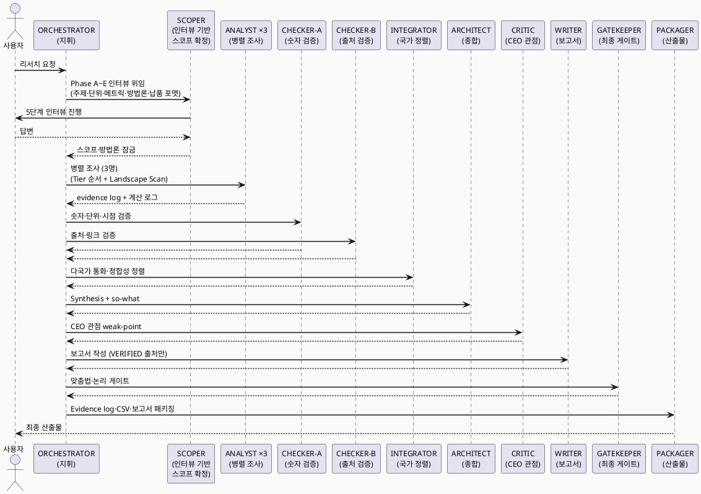

# research-consulting-team

Country-aware consulting-grade research skill for OpenCode. BCG·McKinsey 급 리서치를 9단계 역할 기반 프로세스로 수행합니다.

## 언제 쓰는가

### 이런 상황에 유용합니다

- "이 시장 규모가 얼마야?" — TAM·SAM·SOM 산출이 필요할 때
- "경쟁사 현황 정리해줘" — 플레이어 맵핑·점유율·성장 신호 분석이 필요할 때
- "한국·대만·태국 시장 비교해줘" — 다국가를 같은 포맷으로 정렬해야 할 때
- "CEO 보고용 리서치 만들어줘" — 숫자 출처·계산 근거·confidence rating 이 명시된 defensible 보고서가 필요할 때
- 산업 분석, due diligence, 정책 영향 분석 등 **consulting-grade 근거 품질**이 요구되는 모든 리서치

> 시장 조사, 경쟁 분석이라는 단어를 쓰면 이 스킬이 자동으로 활성화됩니다.

### 동작 방식 — v2.2 (2026-06-15 기준)



### 산출물 예시

```
✅ 시장 규모 테이블 (TAM·SAM·SOM, Bottom-up + Solution sum 이중 검증)
✅ Evidence log (출처·상태·신뢰도 추적, RAW→VERIFIED/REJECTED/SUPERSEDED)
✅ Calculation log (모든 숫자의 계산 경로)
✅ Confidence rating (High/Medium/Low/Insufficient)
✅ 보고서 (Markdown + 필요 시 CSV/HTML)
```

### 실제 사용 예시

```
한국 SaaS 시장 규모 리서치해줘 (2024~2025, TAM·SAM·SOM)
```

```
한국·대만·태국 3개국 핀테크 시장 비교 분석해줘
```

```
리서치팀으로 이커머스 플랫폼 경쟁 환경 맵핑해줘
```


## Role Contracts & Sisyphus Enforcement

v2.2 부터 이 skill 은 Sisyphus 가 sub-agent 를 호출할 때 skill-defined contract 를 강제하도록 구성되어 있습니다. Sisyphus 는 runtime orchestrator 이고, skill 은 persona별 role contract, handoff schema, quality gate 의 source of truth 입니다.

- `references/role-contracts/SCHEMA.md` — `SISYPHUS_HANDOFF_ENVELOPE`, `GATE_RESULT: PASS|FAIL|PARTIAL`, repair code 정의
- `references/role-contracts/INTERACTION-PROTOCOL.md` — Sisyphus pre-flight, verification, repair/rollback loop 정의
- `references/role-contracts/GATE-CHECKLIST-TEMPLATE.md` — persona별 `INPUT_*`, `OUTPUT_*`, `GATE_*` 작성 규칙
- `personas/*.md` — 각 persona 끝의 `Machine Contract (Sisyphus)` 블록이 sub-agent delegation contract 로 사용됨

Rule: sub-agent output must end with a schema-conformant envelope. Sisyphus advances only on `GATE_RESULT: PASS`; `FAIL` and `PARTIAL` trigger repair, rollback, stop, or user clarification.

## Overview

한국·대만·태국·일본 등 국가별 데이터 소스 기준을 다르게 적용하되, 최종 산출물은 동일한 methodology, confidence rating, evidence log, 보고서 포맷으로 정렬합니다.

## 9-Phase Process

```
ORCHESTRATOR → SCOPER → ANALYST ×3 → CHECKER-A → CHECKER-B
→ INTEGRATOR → ARCHITECT → CRITIC → WRITER → GATEKEEPER → PACKAGER
```

| Phase | Role | Key Responsibility |
|---|---|---|
| 0 | ORCHESTRATOR | 전체 지휘, 단계 전환 관리 |
| 1 | SCOPER | 스코프·방법론·옵션 메뉴 (A~F) 잠금 |
| 2 | ANALYST ×3 | 병렬 조사 (Tier 순서 + Market Landscape Scan) |
| 3a | CHECKER-A | 숫자·단위·시점·smell test |
| 3b | CHECKER-B | 출처·링크·인용 검증 |
| 4 | INTEGRATOR | 국가별 정렬·통화·정합성 검증 |
| 5 | ARCHITECT | Synthesis + so-what + 프레임워크 |
| 6 | CRITIC | CEO 관점 weak-point 랭킹 |
| 7 | WRITER | 보고서 작성 |
| 8 | GATEKEEPER | 맞춤법·논리 게이트 |
| 9 | PACKAGER | Evidence log·CSV·HTML·PDF 패키징 |

## Methodology Options (A~F)

SCOPER 단계에서 사용자에게 선택적 적용 여부를 질문합니다:

| Option | Description | Default (High) |
|---|---|---|
| A | Dual Sizing (Bottom-up + Solution sum, ±5% consistency) | ✅ |
| B | Dual Classification (Solution Rows + F1-F6 Function) | ✅ |
| C | Player Column Separation (Company + Service) | ✅ |
| D | Revenue Share Separate Table | ✅ |
| E | 1st Metric Custom Expression per Solution | ✅ |
| F | Wiki Backbone Integration | ✅ (when wiki exists) |

## Key Features

### Evidence Log (Option A — Single File + Status Column)
- `status`: RAW → VERIFIED / REJECTED / SUPERSEDED
- Real-time append by sub-agents
- CHECKER updates status, WRITER uses VERIFIED only
- History preserved (rejected kept for audit trail)

### Calculation Log
- Every intermediate calculation recorded with formula + inputs + sources
- Enables full chain traceability ("where did this number come from?")

### Market Landscape Scan (ANALYST Step 5)
- Map the whole market landscape BEFORE deep research
- Not just "find new startups" — understand who's big, who's growing, who's entering
- Revenue is not the only size metric: MAU, traffic, merchant count matter
- Growth signals: traffic surge, recent funding, corporate subsidiary entry

### Country-Aware Source Hierarchy
Each country has a dedicated guide (`references/countries/{kr,tw,th,jp,global}.md`) with:
- Tier A government sources ranked by priority
- Listed company filing systems (DART/MOPS/SET)
- Recommended research order
- Common pitfalls (calendar systems, currency, informal economy)

### Multi-Session Protocol (Large Runs)
- Single OpenCode session has ~200K token context limit; Large research (6+ segments, 3+ countries, High defensibility) routinely exceeds this
- `references/multi-session-protocol.md` defines 3 split patterns (3-session / 5-7-session / 10+-session) with bootstrap procedure, locked-items policy, CSV header pre-creation
- Auto-apply when segments ≥ 6, countries ≥ 3, defensibility = High, 3+ options applied simultaneously, or expected evidence-log rows ≥ 200
- ORCHESTRATOR checks session context (new run vs. resumed run) before SCOPER hand-off — no repeated SCOPER interview when resuming

## File Structure

```
research-consulting-team/
├── SKILL.md                          # Entry point (9-phase workflow)
├── README.md                         # This file
├── personas/                         # 11 agent personas (00-09)
├── references/                       # 15 reference files (14 specs + countries/)
│   ├── source-tiers.md              # S/A/B/C/D/E/F tier definitions
│   ├── confidence-rating.md         # High/Medium/Low/Insufficient
│   ├── dual-sizing-methodology.md   # Bottom-up + Solution sum
│   ├── classification-framework.md  # Dual classification + rejection rationale
│   ├── player-notation.md           # Company + Service separation rules
│   ├── metrics-standard.md          # 1st metric per solution type
│   ├── evidence-log-spec.md         # Option A: single file + status
│   ├── calculation-log-spec.md      # Computation chain tracking
│   ├── multi-session-protocol.md    # Multi-session split patterns for Large runs
│   ├── methodology-template.md      # Market sizing template
│   ├── report-template.md           # Report markdown format
│   ├── view-spec.md                 # Table/slide spec conversion
│   ├── tier-mapping.md              # Cross-country source equivalence
│   ├── paid-sources-registry.md     # Licensed source catalog
│   └── countries/                   # Per-country source guides
│       ├── kr.md
│       ├── tw.md
│       ├── th.md
│       ├── jp.md
│       └── global.md
├── policies/                         # 3 security policies
│   ├── credentials-policy.md        # ENV-only, no plaintext
│   ├── paid-source-access.md        # License compliance
│   └── env-loading.md               # .env loading guide
├── secrets/                          # Token storage (git-ignored)
├── learning-log/                     # Run records (git-ignored)
└── .gitignore
```

## Applied In

| Country | Version | Status | Evidence | Tables | Notes |
|---|---|---|---|---|---|
| 🇰🇷 KR | v1.5 | ✅ Complete | 99 entries (was 73 in v1.4) | 93+ | Wiki snapshot + Phase 2 retroactive Landscape Scan (K074-K099) |
| 🇹🇼 TW | v2.8 | ✅ Complete | 101 entries (100 VERIFIED, 1 REJECTED) | 25 | Wiki snapshot header added |
| 🇹🇭 TH | v1.1 | ✅ Complete | 170 entries (152 VERIFIED, 16 REJECTED, 2 SUPERSEDED) | 44 | Wiki snapshot header added |
| 🌏 Integrated | v1.1 | ✅ Complete | **370 entries unified** | 104 | KR/TW/TH consolidated, Funnel/Function dual-axis, EN+KR bilingual |

## Security

- No plaintext credentials anywhere (ENV variables only)
- `secrets/.env` git-ignored
- `learning-log/runs/` git-ignored (may contain sensitive research data)
- Citations < 100 words + source attribution mandatory

## Changelog

### v1.8.2 (2026-06-15)

- research-consulting-team v2.2: Sisyphus-enforced role contracts 추가. `references/role-contracts/` 와 persona별 `Machine Contract (Sisyphus)` 블록으로 sub-agent handoff/gate/repair 규칙을 강제.

### v1.8.1 (2026-06-04)

- research-consulting-team v2.1: ANALYST R1-R5 실행 규율 + 언제 쓰는가 섹션 + PlantUML 9-Phase 흐름도

### v1.8 (2026-05-29) — Wiki v10 Alignment + Snapshot Policy (merged with v1.7)
- **Wiki backbone snapshot policy** (`references/wiki-snapshot-policy.md` — new) — mandatory wiki fetch + hash + version recorded at SCOPER phase
- **Funnel × Function dual-axis split** per Wiki Criteria Clarification v10 update (2026-05-26):
  - Old "F1-F6 Function" single-axis → New **FN1-FN6 Funnel** (consumer journey) + **FC1-FC6 Function** (revenue category)
  - `references/classification-framework.md` rewritten with v1.8 dual-axis + N:N mapping + migration guide
  - `personas/01-scoper.md` and `personas/02-analyst.md` updated to reference Funnel/Function split + Wiki snapshot policy
- **Function metric grading** — 실측 / 추정 / 산출 불가 trinary tag with formula and per-input source (Wiki v10 NEW)
- **Drift reconciliation** — KR/TW/TH report cohort relabeled (F1-F6 → FN1-FN6 Funnel) without re-research; Integrated v1.1 published with drift analysis appendix

### v1.7 (2026-05-30) — Multi-Session Protocol + Evidence-Log Alignment
- Add `references/multi-session-protocol.md` — 3 session-split patterns (3 / 5-7 / 10+ sessions), bootstrap procedure, locked-items policy, CSV header pre-creation
- `personas/00-orchestrator.md`: session-context check (new run vs. resumed run) added before SCOPER hand-off
- SKILL.md: project-size guidance expanded with auto-apply conditions (segments ≥ 6, countries ≥ 3, High defensibility, etc.)
- Align CHECKER-A / CHECKER-B / WRITER personas with evidence-log spec:
  - CHECKER-A primary output is `evidence-log.csv` status update (RAW → VERIFIED / REJECTED / SUPERSEDED), recomputation mandatory under Option A/D or High defensibility
  - CHECKER-B finalizes evidence-log (zero RAW rows) and forces all-row status determination before INTEGRATOR hand-off
  - WRITER cites VERIFIED rows only with explicit evidence ID (E001) per body citation
- TH 6-vertical SaaS report v1.0 complete (170 evidence entries, 44 tables, USD 537-843M total) and TW v2.6 → v2.7 (KR v1.4 format alignment) consolidated under this lineage

### v1.6 (2026-05-28)
- Add `references/evidence-log-spec.md` — Option A (single file + status column)
- Add Market Landscape Scan to ANALYST (Step 5)
- Update `personas/02-analyst.md` with growth signal detection + landscape mapping

### v1.5 (2026-05-27)
- Initial GitHub release
- 11 personas + 15 references + 3 policies + 5 country guides
- Methodology options A~F (selective application at SCOPER stage)
- Calculation log spec for computation chain tracing

## License

Internal use only. Do not distribute externally or open-source.
